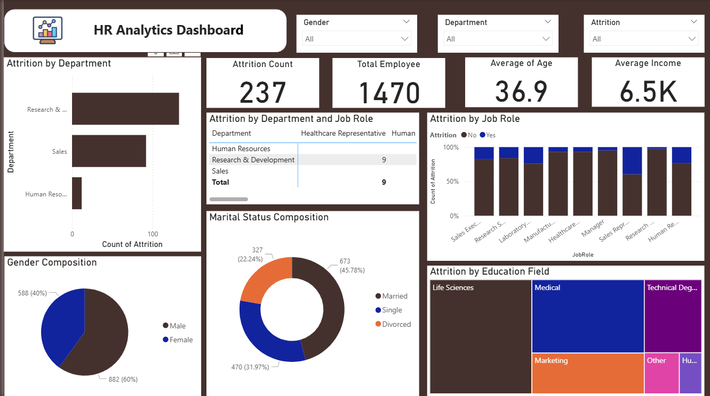

# 👩‍💼 HR Analytics Dashboard

This **Power BI** project presents an interactive and insightful **HR Analytics Dashboard**.
It is designed to monitor key workforce metrics, enabling **HR managers and business leaders** to make data-driven decisions for improving **employee retention, engagement, and performance**.

---

## 🎯 Project Objective

To analyze and visualize HR data by tracking:

* 👥 Workforce demographics (age, gender, department, education)
* 📉 Employee attrition and retention trends
* 📊 Department-wise performance metrics
* 💰 Salary distribution and promotion patterns
* 🕒 Employee tenure and work-life balance insights

---

## 🧹 Data Cleaning & Preparation

Data was preprocessed and cleaned in **Microsoft Excel** before creating the dashboard:

* ✅ Removed duplicate employee records
* ✅ Handled missing values in demographics and salary fields
* ✅ Standardized date formats (hire date, exit date)
* ✅ Converted categorical values (e.g., gender, department) into consistent formats

---

## 📌 Key Dashboard Features

* 🎯 **Attrition Analysis** – Breakdown of employees who left by department, role, and age group
* 👨‍💻 **Department Filter** – Analyze HR metrics at department level
* 📅 **Date Range Slider** – Track workforce changes over time
* 📊 **Employee Demographics Charts** – Age, gender, and education distributions
* 💰 **Salary Insights** – Salary ranges and average salary per department
* 📈 **Retention & Turnover Trend** – Track changes in employee attrition rates
* 📋 **Employee Statistics Table** – Key employee metrics including:

  * Total employees
  * Attrition rate
  * Average salary
  * Average tenure
  * Promotion trends

---

## ⚙️ Tools Used

* **Microsoft Excel** – Data cleaning & preparation
* **Power BI** – Data visualization & dashboard creation

---

## 📈 Insights Derived

* 🚀 Highest attrition rate observed in the **Sales** department
* 📉 Younger employees (age **25–35**) show higher turnover compared to senior staff
* 💰 **R\&D department** employees have the **highest average salary**
* 🕒 Employees with **less than 2 years tenure** are more likely to leave
* 👩‍🎓 **Post-graduate employees** have **better retention** than undergraduates
